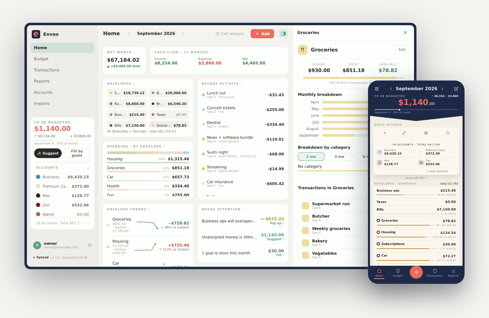

# Enveo

**Every dollar has a place.** Enveo is a private, local-first envelope
budgeting app — YNAB-style zero-based budgeting that runs on your phone, a
foldable and your desktop, self-hosted with a single `docker compose up`.
It installs from the browser, works offline, syncs in the background
(optionally end-to-end encrypted), and your data stays yours.

<p align="center">
  <a href="https://enveo.app"></a>
</p>

<p align="center"><strong>Website: <a href="https://enveo.app">enveo.app</a></strong> · <strong><a href="docs/readme.md">Documentation</a></strong> · AGPL-3.0</p>

## Features

- **Envelope budgeting done right** — carry-over (negatives included),
  transfers, refunds, split transactions, monthly goals.
- **Local-first, no app store** — installs from the browser on iOS, Android
  and desktop; every screen works offline; syncs in the background when a
  server is reachable. Three layouts: phone, foldable, desktop.
- **Optional end-to-end encryption** — the server relays ciphertexts and never
  sees plaintext.
- **AI where it helps, off by default** — screenshot import: add screenshots
  of your banking app or a PDF statement, Enveo recognizes the transactions,
  skips duplicates and proposes envelopes; you review every row, and a
  correction is proposed again for that merchant on the next import. Plus a
  budget assistant that works rule-based with no key at all. Bring your own
  OpenAI key or configure an operator key on the server. A normal budget uses
  the optional server vault; an E2EE budget encrypts the key with its budget
  key and calls OpenAI directly from the unlocked browser.
- **Reports** — net worth, cash flow, spending, budget health.
- **10 languages** ([add yours](CONTRIBUTING.md#add-a-language)), **31
  currencies**, dark mode, two colour themes (Cisza and Duet).

## Roadmap

No dates. In no particular order:

- Native apps for Android and iOS.
- An AI connector, so you can connect your budget to Claude or ChatGPT.
- Several budgets on one account.

## Run it

An empty directory, two generated secrets — nothing is compiled. You bring
**Docker Engine with the Compose v2 plugin** ([Docker's own install
docs](https://docs.docker.com/engine/install/); `docker compose version` must
answer):

```bash
mkdir enveo && cd enveo
curl -fsSL https://raw.githubusercontent.com/enveo/enveo/main/compose.selfhost.yml -o compose.yml
{ echo "POSTGRES_PASSWORD=$(openssl rand -hex 24)"
  echo "BETTER_AUTH_SECRET=$(openssl rand -hex 32)"; } > .env
docker compose up -d
```

That compose file runs **`ghcr.io/enveo/enveo:latest`** — a mutable alias moved
onto a stable release only after that exact image passed the release gate, so it
never serves a prerelease but may advance across a major version. It does not
move under you: restarting an install keeps the image it already has, and you
update deliberately (back up → read the release notes → `docker compose pull` →
recreate → check), as [operations.md](docs/operations.md#update) spells out.

Open **http://localhost:8081** and create the **owner account** right away —
registration closes as soon as it exists, so nobody who finds your URL can sign
themselves up. The budget starts empty; the in-app wizard sets it up.

Using it from your phone needs HTTPS — see **[Self-hosting](docs/install.md)**
for that (and for every knob). No server? **[Railway, Render and
friends](docs/hosting.md)**.

## Documentation

Everything else lives in **[docs/](docs/readme.md)**: [self-hosting in
full](docs/install.md), [managed platforms](docs/hosting.md), [day-2
operations](docs/operations.md), [architecture](docs/architecture.md),
[AI features](docs/ai.md) and [developing](docs/development.md).

## Developing

```bash
cp .env.example .env    # set POSTGRES_PASSWORD and BETTER_AUTH_SECRET (openssl rand -hex 32)
make up                 # build + start → http://127.0.0.1:8081
bun run verify          # typecheck + tests + production build (offline, no database needed)
```

Details (running without Docker, demo data, translations):
**[docs/development.md](docs/development.md)** and
**[CONTRIBUTING.md](CONTRIBUTING.md)**.

## License

[AGPL-3.0](LICENSE) — free to self-host, modify and share; run it as a service
and your changes stay open too.
