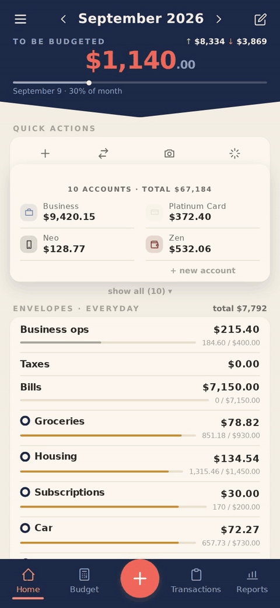
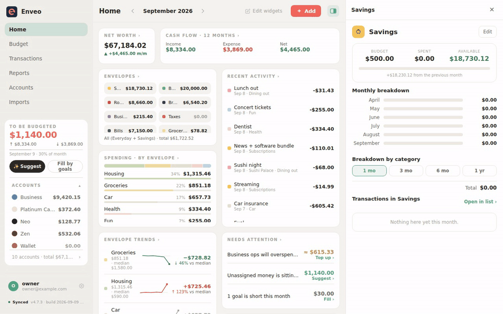
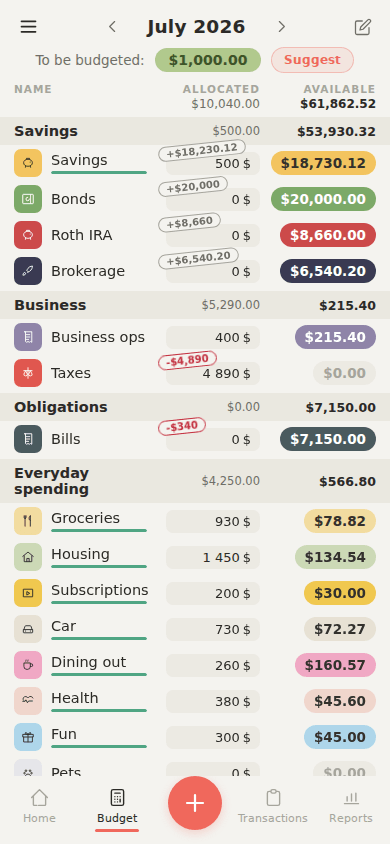
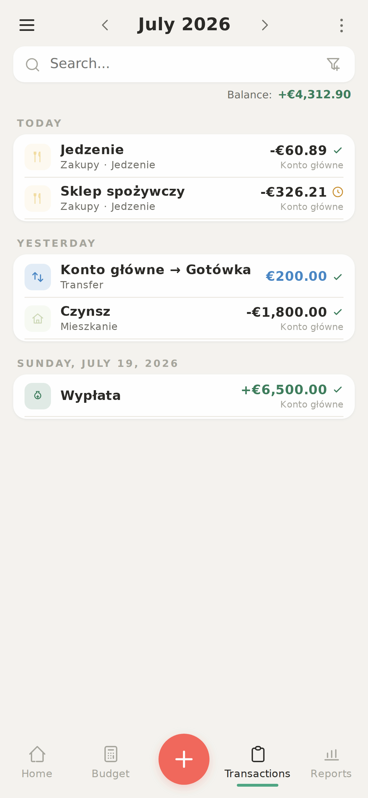
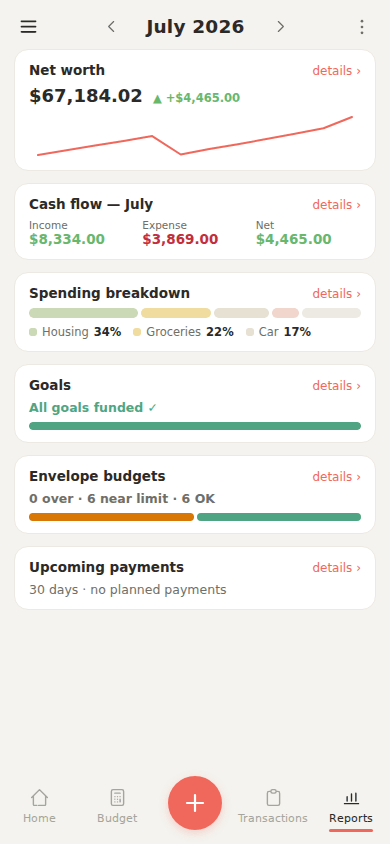
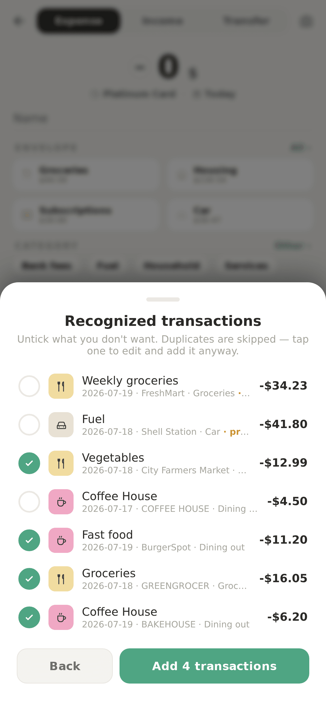
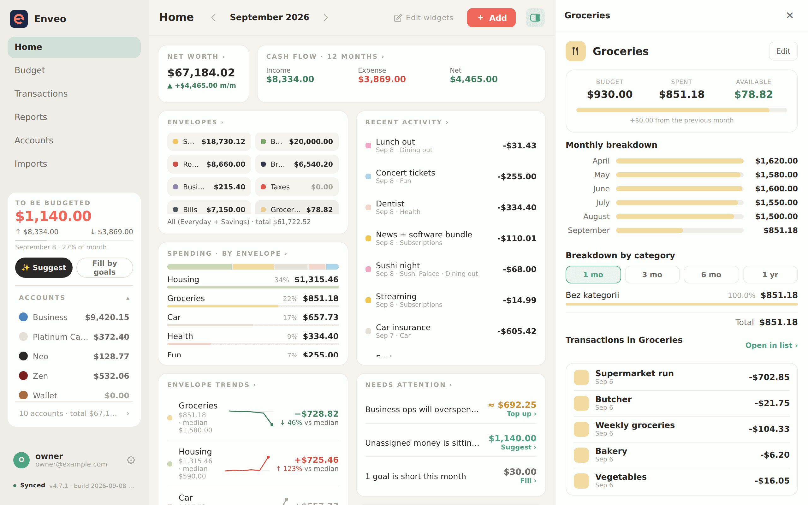
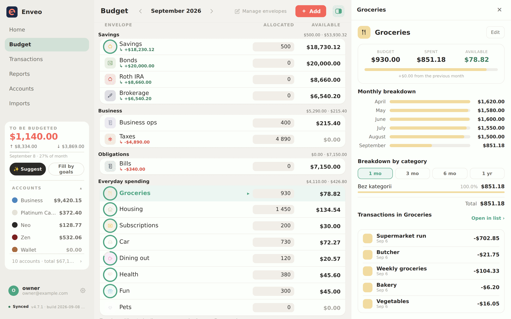
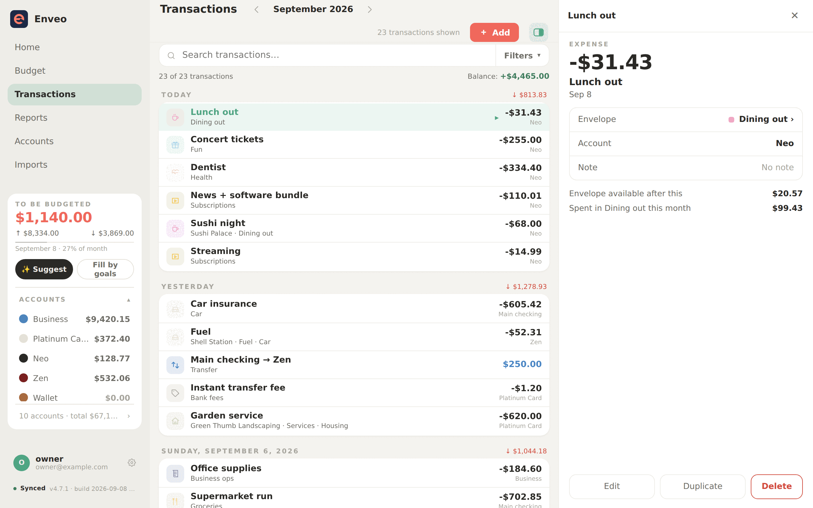
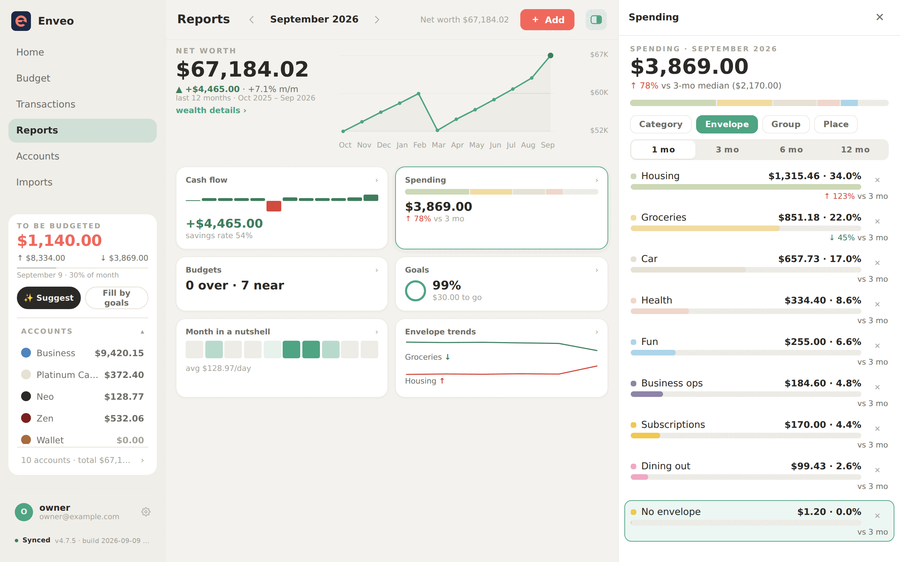

# Enveo documentation

- **[Self-hosting](install.md)** — the Docker quickstart in full: accounts and
  registration, every env var, network exposure, HTTPS and secure cookies.
- **[Managed platforms](hosting.md)** — Railway, Render, PikaPods; publishing
  the image and the one-click template.
- **[Operating it](operations.md)** — updates, backups and restore, password
  reset, version pinning, ports.
- **[Architecture](architecture.md)** — the domain model and its invariant,
  local-first sync, optional end-to-end encryption, the monorepo layout.
- **[AI features](ai.md)** — Without AI, Own OpenAI and Enveo AI, what needs a key, and
  the cost warning for operator keys.
- **[Developing](development.md)** — running from source, demo data, tests,
  adding a translation.
- **[Releasing](releasing.md)** — what a version tag does, the gates it passes,
  and how to recover from a partial release.

## Screens

Synthetic data. Phones open in the Duet theme, wider screens in Cisza — both are a tap away in Settings.

  
  

  
  
  
  
  

  
  

  
  

